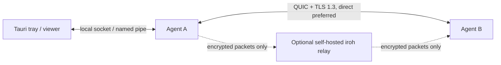
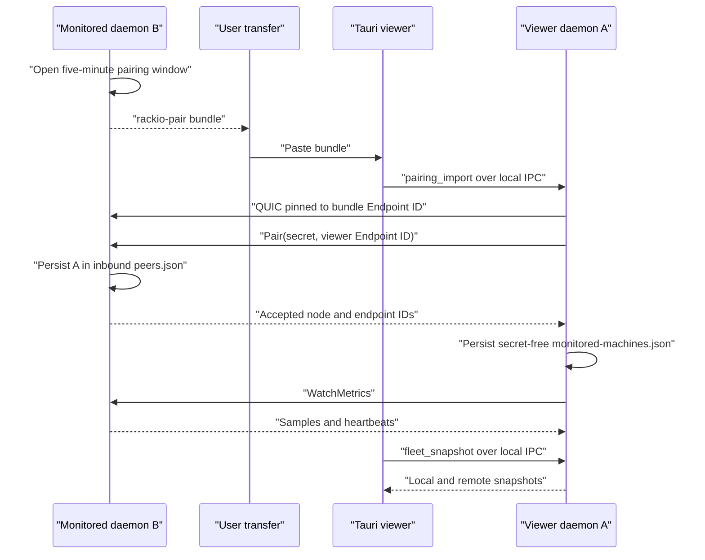

# Architecture

## Product boundary

Each desktop package contains a long-lived agent and a Tauri viewer. A headless
machine runs the same agent with the CLI. The agent is the sole owner of local
sampling, history, endpoint identity, remote authorization and alert state. The
viewer never opens a remote transport itself and never permanently replicates a
peer's history.

## Network defaults

`rackio-iroh` builds endpoints with `presets::Minimal`. This installs the
cryptographic provider only. It does not inherit iroh's N0 DNS discovery or
public relay configuration.

- an empty relay list maps to `RelayMode::Disabled`
- a non-empty list maps only to `RelayMode::custom(user_urls)`
- UPnP, PCP and NAT-PMP gateway probing are explicitly disabled
- direct addresses are carried in the pairing bundle
- the selected iroh path, not the attempted address, determines whether the UI
  reports LAN direct, WAN direct or relayed

The application protocol uses ALPN `rackio/metrics/1` and length-delimited
Protocol Buffers directly on bidirectional QUIC streams. Independent requests
use independent concurrent streams. Frames are limited to 1 MiB to bound
attacker-controlled allocation; history is read and sent in bounded pages as
multiple frames.

## Viewer connection lifecycle

The desktop sends a pairing bundle to its local agent over OS-local IPC. The
agent validates expiry and reachability, pins the bundle Endpoint ID, performs
the one-time pairing request, verifies the returned node identity, and only then
persists a remote machine record. The one-time secret is never written to that
record.

One background monitor per persisted remote machine reconnects with bounded
backoff, opens the live metrics stream, and records path, RTT and local receipt
time. A locally measured 10 seconds without metrics or heartbeat becomes
`stale`; 30 seconds becomes `offline`. Authentication and compatibility errors
remain explicit rather than being collapsed into offline state. The desktop
only renders this local-agent snapshot and never opens iroh itself.

## Authorization

The TLS certificate endpoint ID is the transport identity. Every non-pairing
request checks the local allowlist and its `read_metrics` or `read_history`
permission before dispatch. Every data request includes a protocol version, and
a major mismatch fails closed. A pairing request must:

1. arrive while a five-minute local pairing window is open;
2. claim the same viewer endpoint ID observed on the QUIC connection;
3. present the 256-bit one-time secret;
4. succeed before five failed attempts close the window.

Secrets are compared in constant time and removed immediately after success.
Mutual monitoring requires a separate pairing in the opposite direction.

## Data ownership

Each node stores only its own metrics:

- live sample every 2 seconds
- raw retention for 24 hours
- minute buckets for 7 days
- batch commit every 10 seconds
- 64 MiB database cap, deleting oldest raw rows before minute rows

If a write fails, live sampling continues in memory and health becomes
`storage_degraded`. Missing or unsupported metrics remain absent rather than
being reported as zero.

The viewer stores peer connection information, not remote history. Its current
remote snapshot and short CPU sparkline are memory-resident. Persisting one
last-known remote snapshot across a viewer restart is allowed by the product
contract but is not implemented yet.

## Version policy

The original design assumed pre-1.0 iroh. Implementation began after iroh 1.0,
so the adapter pins exact `iroh = 1.0.3`. All iroh calls remain isolated inside
`rackio-iroh`; upgrading requires the NAT and privacy matrices in
[`release-checklist.md`](release-checklist.md).
