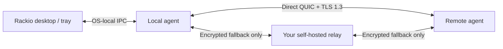

# Installation and operations

This guide is the operator-facing source of truth for installing, pairing and
maintaining Rackio. It describes the intended release workflow as well as the
current source-evaluation workflow. Release eligibility is decided only by
[`release-checklist.md`](release-checklist.md).

> [!WARNING]
> Rackio has no supported public production release yet. In particular,
> `rackio.genm.dev` is a planned distribution endpoint, not evidence that an
> installer or release artifact is available there. Do not use the commands
> below against production machines until the release checklist records the
> required signed-artifact, platform and network evidence. GitHub Release
> ownership, release approval and custom-domain publication are defined in
> [`release-governance.md`](release-governance.md).

## Operating model

Every machine runs the Rackio agent. The agent collects its own metrics,
retains only its own history and owns its endpoint private key. A desktop is
both a viewer and, when its own agent runs, a monitored machine. The tray talks
only to its local agent; agents talk to each other over authenticated QUIC.



No Rackio account, hosted controller, vendor discovery service or public relay
is contacted. A relay is optional and carries encrypted packets only; it can
still observe connection metadata. See [`architecture.md`](architecture.md)
and [`threat-model.md`](threat-model.md) before exposing a relay to the
internet.

## Choose an installation path

| Situation | Path | What it requires |
| --- | --- | --- |
| Developer evaluation on any supported desktop | Run from the source checkout | `mise`, the host prerequisites in [`development.md`](development.md) and a local build |
| Headless Linux evaluation now | Install a published pre-release from its GitHub Release | systemd, `x86_64` or `aarch64`, root or `sudo`, and acceptance that it is unsupported |
| Headless Linux after a supported release exists | Download installer or use the documented HTTPS command | systemd, `x86_64` or `aarch64`, root or `sudo` |
| A Linux host cannot reach a release server | Desktop **Pair machine → SSH** | Existing SSH key/agent access, verified host key, local archive plus checksum, and non-interactive root access |
| macOS or Windows agent | Signed platform package | Not yet supported for public installation; see the release checklist |

Do not substitute an SSH bootstrap or a self-hosted relay for release signing.
They solve different problems: SSH assists an initial Linux installation, while
the P2P transport is used after pairing.

## Evaluate from source

For a local evaluation, use the pinned toolchain:

```sh
mise trust mise.toml
mise run bootstrap
mise run agent:daemon
```

In a second terminal, inspect the local agent and create a one-time pairing
bundle:

```sh
mise exec -- cargo run -p rackio-agent -- status
mise exec -- cargo run -p rackio-agent -- pairing create
```

The bundle expires after five minutes, can be used only once, and grants only
the viewer direction. Treat it like a short-lived secret: transfer it over a
trusted channel, do not paste it into tickets or chat logs, and create a new
one when in doubt.

On the viewer, use **Pair machine** and paste, scan or select the bundle file.
The equivalent CLI flow is:

```sh
mise exec -- cargo run -p rackio-agent -- pairing import 'rackio-pair:...'
mise exec -- cargo run -p rackio-agent -- fleet
```

The first remote metric normally appears within a few seconds for a reachable
peer. `lan_direct`, `wan_direct` and `relayed` are connection-path results,
not user-selected labels. A failed or expired import must remain an error; it
must not create a healthy-looking machine entry.

## Headless Linux evaluation pre-release

An evaluation pre-release is a real, installable build of the headless Linux
agent published as an immutable GitHub pre-release. It removes the need to build
an archive yourself before using either the `curl`-based install or the
desktop's SSH bootstrap. It is not a supported release: the signed macOS and
Windows packages, reboot recovery, and the NAT matrix in
[`release-checklist.md`](release-checklist.md) are still open. Do not run it on
a machine whose monitoring you depend on.

Download the installer and the archive from the release, inspect the installer,
then install the exact version:

```sh
tag=v0.1.0-rc.1
curl --proto '=https' --tlsv1.2 -O "https://github.com/genm/rackio/releases/download/$tag/install.sh"
less install.sh
sh install.sh --version "${tag#v}" \
  --releases-url https://github.com/genm/rackio/releases/download
```

`--version` is mandatory here. A pre-release publishes no version pointer, so a
plain `latest` install cannot select it and fails with that explanation instead
of silently picking another build.

Verify provenance independently before trusting the archive. The checksum
detects transfer corruption and asset mismatch; the GitHub attestation is what
ties the archive to the workflow and commit that produced it:

```sh
gh attestation verify rackio-v0.1.0-rc.1-x86_64-unknown-linux-gnu.tar.gz \
  --repo genm/rackio
```

The desktop SSH bootstrap accepts the same downloaded `.tar.gz` and `.sha256`
pair, which is the fastest way to install and pair a server that has no
internet access.

## Headless Linux release installation

After a signed release has been published, the short form will be:

```sh
curl --proto '=https' --tlsv1.2 -LsSf https://rackio.genm.dev/install.sh | sh
```

For an auditable execution, download and inspect the script first:

```sh
curl --proto '=https' --tlsv1.2 -O https://rackio.genm.dev/install.sh
less install.sh
sh install.sh
```

The installer downloads a versioned archive for `x86_64` or `aarch64`, checks
its SHA-256 digest before running the binary, rejects unsafe archive paths,
installs the systemd service, and fails unless the service and its local health
check succeed. It creates a non-login `rackio` user and a `rackio-viewers`
group. Log out and back in before using Rackio without `sudo`, so your desktop
process has its new group membership.

The installer is intentionally Linux/systemd-only. Its archive layout,
checksum limitations, package build command and rootless integration test are
specified in [`../packaging/README.md`](../packaging/README.md). A checksum
retrieved from the same origin detects transfer corruption and asset mismatch;
it is not independent provenance. Do not treat it as a substitute for the
required release signature or attestation.

After installation:

```sh
sudo rackio status
sudo rackio pairing create
sudo journalctl -u rackio.service -e
```

The installed agent starts in direct-only mode. Configure a relay only when
you operate or explicitly trust its URL:

```sh
sudo rackio relay set https://relay.example.test
sudo systemctl restart rackio.service
```

`example.test` is a reserved documentation hostname. A relay endpoint does
not make the relay an identity authority and does not make a relayed path
direct.

## Keep a monitored machine reachable across restarts

By default an agent listens on an ephemeral UDP port, which the OS reassigns on
every restart. Viewers hold the direct addresses they were paired on, so a
restarted machine that moves to another port is unreachable to them until it is
paired again. On any machine other operators monitor over a direct path,
configure a fixed listen port:

```sh
sudo rackio listen-port set 7777
sudo systemctl restart rackio.service
sudo rackio status   # `bind_port` and every direct address show the fixed port
```

The setting takes effect on the next start. If the port is already in use the
daemon fails to start and says so; it never falls back to an ephemeral port,
because that would silently strand the viewers this setting exists to protect.
`sudo rackio listen-port set ephemeral` returns to an OS-assigned port.

A viewer whose stored addresses stop answering reports the machine as `offline`
with a message naming this command. It keeps the last known values and never
reports the machine as healthy. Recovering means putting the machine back on an
address the viewer knows — by restoring the port or forwarding rule — or pairing
again; do not hand-edit `monitored-machines.json`.

When a relay is configured, viewers also reconnect through the relay and learn
the machine's current direct address from that authenticated session, so a
direct path is restored without re-pairing.

## Pair a machine behind NAT

A machine behind a router only sees its own LAN addresses, so a bundle it
creates carries `192.168.x.y:PORT` — an address no viewer outside that LAN can
use. Rackio does not discover the router's external address: nothing is probed
and no discovery service is contacted. Tell the agent the address you already
know instead.

On the monitored machine, fix the listen port, forward that same UDP port on the
router to this machine, then advertise the forwarded address:

```sh
sudo rackio listen-port set 41641
sudo systemctl restart rackio.service
sudo rackio advertise-address add 198.51.100.7:41641   # the router's forwarded address
sudo systemctl restart rackio.service
sudo rackio advertise-address list
sudo rackio pairing create
```

The bundle then carries the machine's own interface addresses *and* the
advertised ones, so the same bundle pairs from inside the LAN and from outside
it. Advertised addresses take effect for bundles created afterwards; already
paired viewers keep the addresses they were given.

The restart above is what hands the address to the endpoint itself, which is
why `advertise-address add` and `remove` report `restart_required`. After it,
`rackio status` lists the advertised address among its `direct_addresses` — the
way to confirm from the machine that the setting took effect — and the address
is a candidate for path selection, so a session that fell back to a relay can
return to a direct path without waiting for the next connection. Up to eight
addresses are
kept — adding a ninth is refused, naming the address to remove first, rather
than dropping one silently. `sudo rackio advertise-address remove
198.51.100.7:41641` stops advertising one.

Rackio stores the address exactly as given. It never resolves a hostname,
probes the address, or asks anything on the internet to confirm it, so a typo or
a forwarding rule that is not in place is not corrected: it behaves as an
ordinary unreachable candidate, and the viewer reports the machine as `offline`
with its recovery hint. Verify the forwarding rule on the router itself.

Nothing here discovers an address for you. It works when the operator knows a
stable UDP address for the machine — a forwarded port, or the address an
endpoint-independent ("cone") NAT maps it to. With a self-hosted relay
configured on both sides to carry the address exchange, two such machines can
open a direct path between them without any port forward. A machine behind
carrier-grade NAT or a symmetric NAT, whose mapped port changes per
destination, has no stable address to advertise and is reached through the
relay.

## SSH-assisted Linux bootstrap

The desktop’s **Pair machine → SSH** path is for a trusted operator who already
has administrative SSH access to a Linux server. It uploads a local release
archive, its checksum and the installer to a temporary server directory. The
server verifies the archive locally, installs the systemd service, opens a
one-time pairing window, and the desktop imports the returned bundle over the
normal P2P pairing path. The server does not download Rackio from the internet.

Before using it, prepare:

- a Linux systemd host with `x86_64` or `aarch64` architecture;
- key or SSH-agent authentication (optionally choose a local identity file);
- either `root` login or passwordless `sudo` for the SSH user;
- the exact local `.tar.gz` release archive and its matching `.sha256` file;
- the server’s SSH host-key fingerprint obtained through a trusted, independent
  channel.

The desktop deliberately uses non-interactive SSH (`BatchMode=yes`); it never
prompts for, captures or stores an SSH password. It displays the fingerprint
returned by the server, requires an explicit confirmation, rechecks the host
key immediately before the upload, then uses strict host-key checking for SSH
and SCP. A host-key change stops the installation.

`ssh-keyscan` only obtains a key presented on the network; it does **not**
authenticate that key. Verify the displayed fingerprint through an existing
trusted path such as a console, inventory system, or an administrator you can
independently reach. The accepted keys are stored in Rackio’s local application
configuration so later SSH/SCP calls stay pinned. If a connection drops before
cleanup, inspect and remove only the matching `/tmp/rackio-bootstrap.*`
directory on the target after confirming it belongs to this operation.

SSH is solely the first-install transport. Once pairing succeeds, monitoring
uses Rackio’s pinned-endpoint QUIC connection and follows the direct-first,
self-hosted-relay-fallback policy. Do not interpret a successful SSH session as
proof that P2P reachability or NAT traversal will work; the desktop reports the
actual P2P path separately.

## Health and incident interpretation

| UI state | Meaning | First operator action |
| --- | --- | --- |
| `healthy` | Fresh metrics and no active health warning | None |
| `warning` / `critical` | A configured local health threshold was crossed | Open the machine detail and inspect the affected resource |
| `stale` | No metric or heartbeat for 10 seconds | Check path, RTT and local agent logs; preserve last known values |
| `offline` | No metric or heartbeat for 30 seconds | Check agent process, network reachability and relay availability if shown as relayed; if the machine restarted on a new port, give it a fixed listen port |
| `auth_error` | The remote agent rejected this viewer | Confirm endpoint pairing and allowlist; do not retry with a reused bundle |
| `incompatible` | Protocol major versions differ | Upgrade or roll back a machine to a compatible release |
| `degraded` | A collector, storage, notification or local dependency failed | Read the displayed error and structured agent logs; values are not silently zeroed |

### Configuring local health thresholds

`warning` and `critical` are only reachable when an operator defines a
threshold. Rackio ships none: it has no basis for deciding what CPU or disk
level matters on a machine it knows nothing about. Add rules to the `alerts`
array in the daemon's `config.json`:

```json
{
  "alerts": [
    {
      "id": "disk-critical",
      "metric": "disk_percent",
      "comparison": "greater_than_or_equal",
      "threshold": 90.0,
      "consecutive_samples": 3,
      "severity": "critical"
    }
  ]
}
```

`metric` accepts `cpu_percent`, `memory_percent`, `disk_percent` and
`temperature_celsius` (`disk_percent` uses the fullest mounted filesystem, and
`temperature_celsius` the hottest readable sensor). A machine whose
`temperature` capability is `unsupported` never resolves a
`temperature_celsius` rule, so the rule stays inactive there rather than
reading as a cold machine. `consecutive_samples`
requires that many two-second samples in a row before the state changes, which
suppresses flapping. A rule whose metric becomes unreadable clears rather than
staying latched, and a degraded collector or storage subsystem still reports
`degraded` in preference to a threshold state, because the underlying values
are no longer trustworthy. Restart the daemon after editing the file.

When storage is degraded, live sampling continues in memory but history may not
persist. When a relay is unavailable, a direct peer may stay connected while a
relay-only peer becomes offline. Those are distinct conditions, not a general
fleet failure.

## Back up, revoke and remove

Rackio intentionally keeps each machine’s own identity, pairing state and
history local. A preserving uninstall removes the service and binary but leaves
`/etc/rackio`, `/var/lib/rackio` and `/var/log/rackio` in place for recovery:

```sh
sudo /usr/local/lib/rackio/uninstall.sh
```

Use purge only when you intend to permanently discard the local identity,
pairing records, metrics and logs:

```sh
sudo /usr/local/lib/rackio/uninstall.sh --purge
```

Before decommissioning a machine, revoke it from every viewer that monitors it.
Revocation cuts active connections immediately. Backups containing
`identity.key`, `peers.json`, `monitored-machines.json` or `metrics.sqlite3`
are sensitive: protect them as machine credentials and monitoring data, and do
not copy a private key to a second running machine.

## Evidence and support boundary

Run `mise run check` for source-tree verification. The focused tests are
`mise run test:pairing` (live pairing, replay rejection and reconnect) and
`mise run test:installer` (normal install, idempotent reinstall and checksum
rejection). They are implementation evidence, not a claim of a supported
release or a substitute for the cross-OS and NAT matrix.

For a failure that may expose keys, pairing bundles, metrics or routable
addresses, follow [`../SECURITY.md`](../SECURITY.md) rather than posting those
details publicly.
